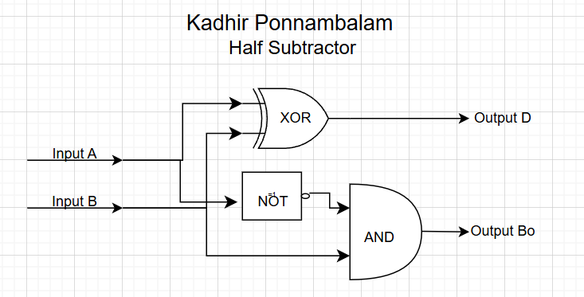
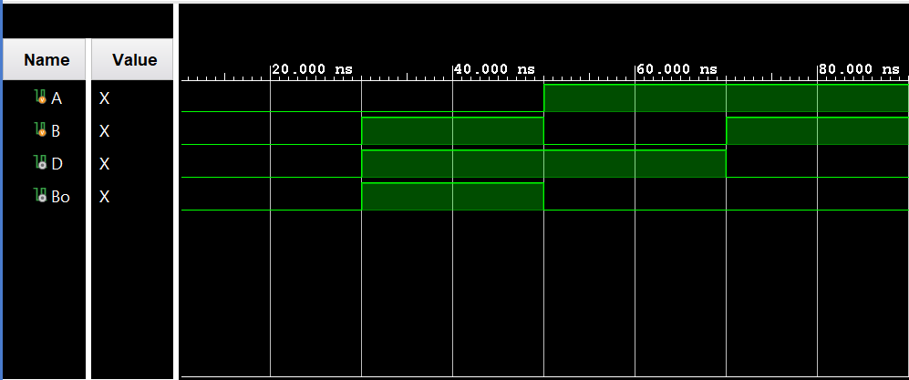

## Half Subtractor Using Logic Gates (Verilog)

A Verilog implementation of a **1‑bit half subtractor**, developed using the Vivado IDE. This document explains the underlying theory, presents the truth table, shows how Karnaugh maps (K‑maps) lead to minimized Boolean expressions, and summarizes the circuit, waveform, and simulation results.

---

## Table of Contents

- [What Is a Half Subtractor?](#what-is-a-half-subtractor)
- [Half Subtractor Theory](#half-subtractor-theory)
- [Learning Resources](#learning-resources)
- [Truth Table](#truth-table)
- [K-Maps and Boolean Derivations](#k-maps-and-boolean-derivations)
  - [Difference Output \(D\) K-Map](#difference-output-d-k-map)
  - [Borrow Output \(B<sub>o</sub>\) K-Map](#borrow-output-bo-k-map)
- [Half Subtractor Architecture](#half-subtractor-architecture)
- [Circuit Diagram](#circuit-diagram)
- [Waveform Diagram](#waveform-diagram)
- [Testbench Output](#testbench-output)
- [Running the Project in Vivado](#running-the-project-in-vivado)
- [Project Files](#project-files)

---

## What Is a Half Subtractor?

A **half subtractor** is a combinational circuit that **subtracts one single‑bit binary value from another single‑bit binary value**. It has two inputs and two outputs:

- **Inputs**
  - A – minuend bit (the bit from which we subtract).
  - B – subtrahend bit (the bit that is subtracted from A).
- **Outputs**
  - D – difference bit, representing \(A - B\) modulo 2.
  - B<sub>o</sub> – borrow‑out bit, which becomes 1 when the subtraction would otherwise be negative (i.e., when \(A < B\)).

In binary subtraction, if we attempt to compute \(A - B\) and \(A = 0, B = 1\), the result would be \(-1\), which is not representable as a non‑borrowed single bit. In such a case, we **borrow 1 from the next more significant bit**, effectively adding 2 to A and setting the borrow‑out \(B<sub>o</sub> = 1\). The half subtractor captures exactly this behavior for a single bit position.

---

## Half Subtractor Theory

The half subtractor implements the subtraction:

\[
D = A - B
\]

with outputs:

- **Difference \(D\)**: the lower‑order bit of the result.
- **Borrow‑out \(B<sub>o</sub>)**: indicates whether a borrow is needed from the next higher bit.

From the truth table (shown below), we obtain the minimized Boolean expressions:

- $$\(D = A'B + AB' = A \oplus B\)$$
- $$\(B\_o = A'B\)$$

where:

- \(A'\) denotes NOT A.
- $$\(A \oplus B\)$$ is the XOR of A and B.

In this project, the Verilog module `halfSubtractor` realizes these equations using basic logic gates or continuous assignments.

---

## Learning Resources

Useful online resources for half subtractors, binary subtraction, K‑maps, and digital design:

| Resource | Description |
|----------|-------------|
| [Half Subtractor (YouTube)](https://www.youtube.com/results?search_query=half+subtractor) | Concept, truth table, and typical gate‑level implementations. |
| [Binary Subtraction & Borrow (YouTube)](https://www.youtube.com/results?search_query=binary+subtraction+with+borrow) | Explains how borrowing works in binary subtraction. |
| [K-Map Simplification (YouTube)](https://www.youtube.com/results?search_query=karnaugh+map+simplification) | Karnaugh‑map based derivation of minimal Boolean expressions. |
| [Verilog Combinational Circuits (YouTube)](https://www.youtube.com/results?search_query=verilog+combinational+circuits) | RTL and testbench examples for basic logic circuits in Verilog. |

---

## Truth Table

The half subtractor has two inputs A, B and two outputs D, B<sub>o</sub>. The truth table is:

| **A** | **B** | **‖** | **D** | **B<sub>o</sub>** |
|:-----:|:-----:|:-----:|:-----:|:-----------:|
| **———** | **———** | **———** | **———** | **———** |
| 0 | 0 | **\|** | 0 | 0 |
| 0 | 1 | **\|** | 1 | 1 |
| 1 | 0 | **\|** | 1 | 0 |
| 1 | 1 | **\|** | 0 | 0 |

This is the **final truth table** of the 1‑bit half subtractor. It directly reflects the rules of single‑bit binary subtraction:

- When \(A = B\), the difference D is 0 and no borrow is needed.
- When $$\(A \ne B\)$$, the difference D is 1; a borrow occurs only when \(A = 0, B = 1\).

---

## K-Maps and Boolean Derivations

### Difference Output \(D\) K-Map

We treat A as the row variable and B as the column variable, in Gray code order 0, 1.

**K-map for D:**

| **A \\ B** | **0** | **1** |
|:----------:|:-----:|:-----:|
| **0** | 0 | 1 |
| **1** | 1 | 0 |

From the K‑map, D is 1 whenever **A and B differ**. Grouping the 1s gives:

- \(D = A'B + AB'\)
- $$\(D = A \oplus B\)$$

### $$Borrow Output \(B\_o\) K-Map$$

**K-map for \(B<sub>o</sub>):**

| **A \\ B** | **0** | **1** |
|:----------:|:-----:|:-----:|
| **0** | 0 | 1 |
| **1** | 0 | 0 |

There is a single 1 cell at \(A = 0, B = 1\), giving:

- $$\(B\_o = A'B\)$$

These minimized equations are exactly what the `halfSubtractor` module implements.

---

## Half Subtractor Architecture

The half subtractor can be implemented using a small set of logic gates:

- **Difference \(D\)**: realized as an XOR between A and B.
- **Borrow‑out \(B<sub>o</sub>)**: realized as an AND gate with A inverted and B as inputs.

Conceptually:

1. Invert A to produce \(A'\).
2. AND \(A'\) with B to produce the borrow‑out \(B<sub>o</sub>).
3. XOR A and B to produce the difference D.

In Verilog, this can be written using **continuous assignments** (e.g., `assign`) or explicit gate instantiations. A typical port mapping is:

- Inputs: `A`, `B`
- Outputs: `D`, `Bo` (used in code to represent \(B<sub>o</sub>))

---

## Circuit Diagram

This section corresponds to the **logic diagram** of the half subtractor, showing:

- An XOR gate producing D from A and B.
- An inverter on A feeding an AND gate with B, producing \(B<sub>o</sub>).



---

## Waveform Diagram

The behavioral simulation waveform shows inputs A and B cycling through all four possible combinations, while outputs D and \(B<sub>o</sub>) follow the expected subtraction results from the truth table.



---

## Testbench Output

The testbench applies each combination of A and B and prints the resulting difference and borrow‑out. A representative simulation log is:

```text
A = 0, B = 0, D = 0, Bo = 0
A = 0, B = 1, D = 1, Bo = 1
A = 1, B = 0, D = 1, Bo = 0
A = 1, B = 1, D = 0, Bo = 0
```

These results match the theoretical half subtractor truth table exactly, confirming that the **half subtractor implementation is functionally correct**.

---

## Running the Project in Vivado

Follow these steps to open the project in **Vivado** and run the simulation.

### Prerequisites

- **Xilinx Vivado** installed (Vivado HL Design Edition, Lab Edition, or any recent version compatible with your OS).

### 1. Launch Vivado

1. Start Vivado from the Start Menu (Windows) or your application launcher.
2. Choose **Vivado** (or **Vivado HLx**).

### 2. Create a New RTL Project

1. Click **Create Project** (or **File → Project → New**).
2. Click **Next** on the welcome page.
3. Choose **RTL Project** and leave **Do not specify sources at this time** unchecked if you plan to add sources immediately.
4. Click **Next**.

### 3. Add Design and Simulation Sources

1. In the **Add Sources** step, add the Verilog design files:
   - **Design sources:**
     - `halfSubtractor.v` – 1‑bit half subtractor module.
   - **Simulation sources:**
     - `halfSubtractor_tb.v` – testbench applying all input combinations and printing/observing the outputs.
2. Ensure the testbench is set as the **top module for simulation**:
   - In the **Sources** window, under **Simulation Sources**, right‑click `halfSubtractor_tb.v` → **Set as Top**.
3. Click **Next**, choose a suitable **target device** (or leave default/“Don’t specify” for simulation‑only usage), then **Next → Finish**.

### 4. Run Behavioral Simulation

1. In the **Flow Navigator** (left panel), under **Simulation**, click **Run Behavioral Simulation**.
2. Vivado will:
   - Elaborate the design hierarchy (`halfSubtractor` as the DUT).
   - Compile the design and testbench.
   - Open the **Simulation** view with the waveform.
3. Inspect the waveform:
   - Confirm that A and B cycle through all four combinations: 00, 01, 10, 11.
   - Verify that D and \(B\_o\) match the half subtractor truth table.

### 5. (Optional) Re-run or Modify the Design

- To re-run the simulation, use **Flow Navigator → Simulation → Run Behavioral Simulation** or the re‑run icon in the simulation toolbar.
- To change the design or testbench:
  - Edit `halfSubtractor.v` or `halfSubtractor_tb.v`.
  - Save the files.
  - Re-run the behavioral simulation.

### 6. (Optional) Synthesis, Implementation, and Bitstream

If you want to map the design to a physical FPGA:

1. In **Sources**, right‑click the top-level RTL module (e.g., `halfSubtractor.v`) → **Set as Top** (for synthesis/implementation).
2. Run **Synthesis** from the Flow Navigator.
3. Run **Implementation**.
4. Create or edit a constraints file (e.g. `.xdc`) to assign pins for A, B, D, and \(B<sub>o</sub>).
5. Run **Generate Bitstream** to produce the configuration file for your FPGA board.

---

## Project Files

- `halfSubtractor.v` — RTL for the 1‑bit half subtractor (A, B) → (D, B<sub>o</sub>).
- `halfSubtractor_tb.v` — Testbench for the half subtractor; applies all input combinations and prints/observes the outputs.

*Author: **Kadhir Ponnambalam***

# Half-Subtractor
Implemented a half subtractor. More details on the process in the README
